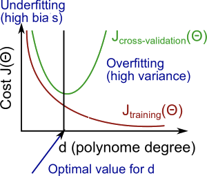

# Advice for Applying Machine Learning
> - How to tell when a learning algorithm is doing poorly
> - Describe the 'best practices' for how to 'debug' your learning algorithm and  go about improving its performance
> - Discuss how to understand the performance of a machine learning system with multiple  pars
> - how to deal with skewed data

### Evaluating a Learning Algorithm

* Debugging a learning algorithm

* Machine learning diagnostic

  * Diagnostic : A test that you can run to gain insight what is/isn't working with a learning algorithm, and gain guidance as to how best to improve its performance.

  * Diagnostics can give guidance as to what might be more fruitful things to try to improve a learning algorithm.

  * Diagnostics can be time-consuming to implement and try, but they can still be a very good use of your time

  * A diagnostic can sometimes rule out certain courses of action (changes to your learning algorithm) as being unlikely to improve its performance significantly.

### Evaluating a hypothesis

* A hypothesis may have a low error for the training examples but still be inaccurate (because of overfitting). Thus, to evaluate a hypothesis, given a dataset of training examples, we can split up the data into two sets: a **training set** and a **test set**. Typically, the training set consists of 70 % of your data and the test set is the remaining 30 %.
* The new procedure using these two sets is then:
  * Learn  $\Theta $ and minimize ${J_{train}}\left( \Theta  \right)$ using the training set
  * Compute the test set error ${J_{test}}\left( \Theta  \right)$

####  The test set error

* For linear regression : ${J_{test}}\left( \Theta  \right) = {1 \over {2{m_{test}}}}\sum\limits_{i = 1}^{{m_{test}}} {{{({h_\Theta }(x_{test}^{(i)}) - y_{test}^{(i)})}^2}} $

* For classification ~ Misclassification error (aka 0/1 misclassification error) :

  $$err({h_\Theta }(x),y) = \left\{ {\matrix{
     1 & {{\rm{ if }}{h_\Theta }(x) \ge 0.5{\rm{ }}and{\rm{ }}y = 0{\rm{ }}or{\rm{ }}{h_\Theta }(x) < 0.5{\rm{ }}and{\rm{ }}y = 1}  \cr 
     0 & {otherwise}  \cr  } } \right.$$

  This gives us a binary 0 or 1 error result based on a misclassification. The average test error for the test set is:

  $Test{\rm{ }}Error = {1 \over {{m_{test}}}}\sum\limits_{i = 1}^{{m_{test}}} {err({h_\Theta }(x_{test}^{(i)}),y_{test}^{(i)})} $

  This gives us the proportion of the test data that was misclassified.

### Model Selection

*  Just because a learning algorithm fits a training set well, that does not mean it is a good hypothesis. It could over fit and as a result your predictions on the test set would be poor. The error of your hypothesis as measured on the data set with which you trained the parameters will be lower than the error on any other data set. 

* Given many models with different polynomial degrees, we can use a systematic approach to identify the `best` function. In order to choose the model of your hypothesis, you can test each degree of polynomial and look at the error result.

* One way to break down our dataset into the three sets is:
  * Training set: 60%
  * Cross validation set: 20%
  * Test set: 20%

* We can now calculate three separate error values for the three different sets using the following method:

  1. Optimize the parameters in $\Theta $ using the training set for each polynomial degree.
  2. Find the polynomial degree d with the least error using the cross validation set.
  3. Estimate the generalization error using the test set with ${J_{test}}({\Theta ^{(d)}})$ (d = theta from polynomial with lower error);

  This way, the degree of the polynomial d has not been trained using the test set.

### Bias and variance

Knowing  bias and variance will give you a very strong indicator for what the useful and promising ways to try to improve your algorithm.

* In this section we examine the relationship between the degree of the polynomial d and the underfitting or overfitting of our hypothesis.
  * We need to distinguish whether **bias** or **variance** is the problem contributing to bad predictions.
  * High bias is underfitting and high variance is overfitting. Ideally, we need to find a golden mean between these two.

* The training error will tend to **decrease** as we increase the degree d of the polynomial.

  At the same time, the cross validation error will tend to **decrease** as we increase d up to a point, and then it will **increase** as d is increased, forming a convex curve. 

* **High bias (underfitting)**: both ${J_{train}}(\Theta )$ and  ${J_{CV}}(\Theta )$ will be high. Also, ${J_{train}}(\Theta )$ ≈${J_{CV}}(\Theta )$.

  **High variance (overfitting)**:  ${J_{train}}(\Theta )$ will be low and  ${J_{CV}}(\Theta )$ will be much greater than ${J_{train}}(\Theta )$.

  * The is summarized in the figure below:

   

### Regularization and Bias/Variance

  

* In the figure above, we see that as $\lambda$ increases, our fit becomes more rigid. On the other hand, as $ \lambda$ approaches 0, we tend to overfit the data. So how do we choose our parameter$  \lambda$  to get it 'just right' ? In order to choose the model and the regularization term $ \lambda$, we need to:
  1. Create a list of lambdas (i.e. λ∈{0,0.01,0.02,0.04,0.08,0.16,0.32,0.64,1.28,2.56,5.12,10.24});
  2. Create a set of models with different degrees or any other variants.
  3. Iterate through the $\lambda$s and for each $lambda$ go through all the models to learn some $\Theta$.
  4. Compute the cross validation error using the learned Θ (computed with λ) on the  ${J_{CV}}(\Theta )$ **without** regularization or λ = 0.
  5. Select the best combo that produces the lowest error on the cross validation set.
  6. Using the best combo Θ and λ, apply it on$ J_{test}(\Theta)$to see if it has a good generalization of the problem.

### Learning curves

